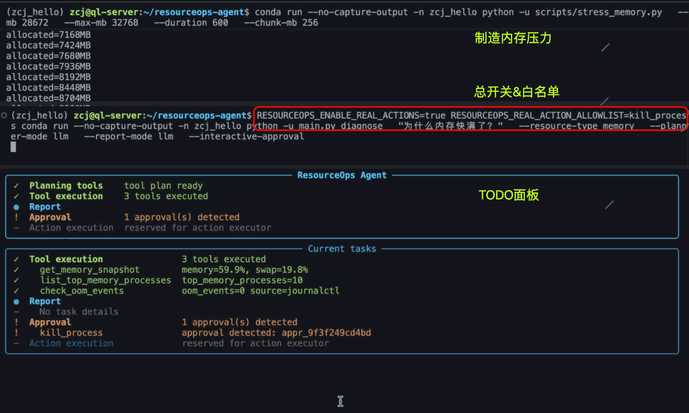
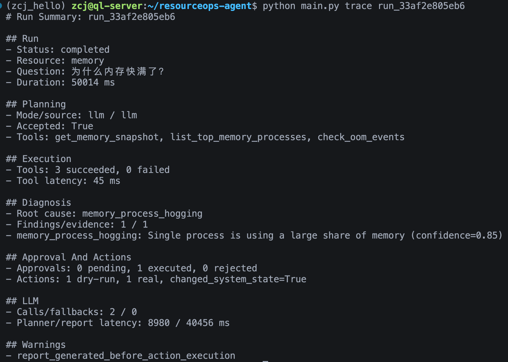
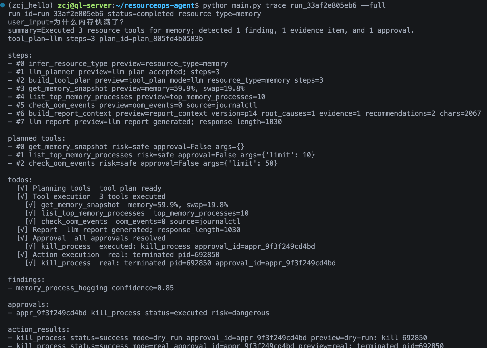
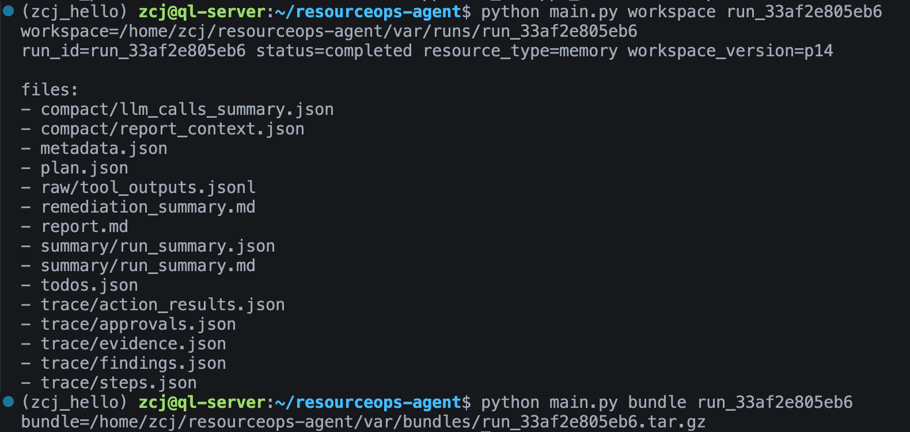
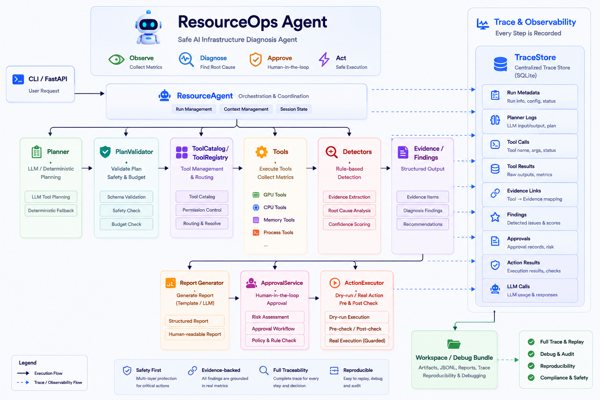

# ResourceOps Agent

> 面向 AI/ML 本地训练环境的安全资源诊断 Agent：通过受约束的 LLM 工具规划、确定性检测、结构化证据链和人工审批机制，诊断 GPU、CPU、内存、Swap、OOM 与进程级资源问题。


<p align="center">
  <a href="https://github.com/9leaa/resourceops-agent/actions">
    
  </a>
  
  
  
  
</p>

---

## Demo

<!--
【素材 2：唯一的核心运行 Demo】
路径：docs/assets/demo/resourceops-demo.gif
建议时长：25～45 秒

建议完整展示一次高风险诊断：
1. 输入诊断命令
2. Agent 推断资源类型
3. LLM 提出 ToolPlan
4. PlanValidator 校验
5. ToolRegistry 执行资源工具
6. 生成 Evidence / Finding / Recommendation
7. 出现 Approval
8. 用户审批
9. 展示 Dry-run 或受控真实执行
10. 最后展示报告或 run_id

录制要求：
- 终端宽度固定，字体足够大
- 隐藏 API Key、服务器地址、用户名和敏感 PID
- 不要长时间停留在 LLM 等待阶段
- Demo 已覆盖完整流程，README 后面不再重复放 GPU、CPU、内存等场景截图
-->
<p align="center">
  
</p>

```text
User Request
  → Tool Planning
  → Plan Validation
  → Resource Collection
  → Evidence / Finding
  → Report
  → Approval
  → Dry-run / Guarded Real Action
  → Trace / Workspace
```

---

## Why ResourceOps

排查训练变慢、显存占满、CPU 饱和或内存异常时，开发者通常需要分别查看 `nvidia-smi`、`top`、`ps`、Swap 状态与 OOM 日志，再手动拼接证据和判断根因。

ResourceOps 将分散的系统信号转化为：

```text
Tool Result → Evidence → Diagnosis Finding → Recommendation → Approval / Action
```

它不是只展示指标，而是完成“采集、判断、解释、审批、执行、追溯”的诊断闭环。

---

## Core Capabilities

### 1. Evidence-backed Resource Diagnosis

- 采集 GPU、CPU、内存、Swap、OOM 和进程信息
- 识别 GPU 显存压力、CPU 饱和、训练瓶颈、内存/Swap 压力及异常进程
- 将工具结果转换为结构化 `EvidenceItem` 与 `DiagnosisFinding`
- 每个诊断结论均可回溯到实际工具输出

### 2. Bounded LLM Planning

LLM 只生成候选 `ToolPlan`，不能直接执行系统工具。`PlanValidator` 会检查工具名称、参数 Schema、调用预算、重复调用、Resource Type、Permission Level 以及危险工具权限；非法计划自动回退至确定性方案。

### 3. Human-in-the-loop Execution

```text
Approval
  → Dry-run
  → Environment Gate
  → Action Allowlist
  → Pre-check
  → Explicit Confirmation
  → Real Execution
  → Post-check
```

| Action | Risk | Execution |
|---|---|---|
| `inspect_process` | Safe | Read-only |
| `renice_process` | Write | Approval + Dry-run + Real Gate |
| `kill_process` | Dangerous | Approval + Dry-run + Real Gate |

### 4. Decoupled Diagnosis and Reporting

工具采集和规则检测完成后，系统立即持久化 Evidence、Finding、Approval、Todo 与 Trace；LLM 报告独立生成，使审批不再被长耗时报告阻塞。

---

## Traceability and Reproducibility

ResourceOps 会把一次运行中的计划、工具调用、证据、诊断结论、审批和执行结果关联到同一个 `run_id`，并同时写入 SQLite Trace 与独立 Workspace。

### Trace Summary

```bash
python main.py trace <run_id>
```

<!--
【素材 3：Trace 总览截图】
路径：docs/assets/trace/trace-summary.png

截图应展示：
- run_id
- run status
- planner_mode / report_mode
- resource_type
- root cause / summary
- Tool execution、Report、Approval、Action 等阶段状态
- Finding、Evidence、Approval 的数量

目的：证明一次诊断不是只有最终报告，而是存在完整运行状态和阶段记录。
-->
<p align="center">
  
</p>

### Step-level Trace

```bash
python main.py trace <run_id> --full
python main.py trace <run_id> --step llm_planner
python main.py trace <run_id> --llm
```

<!--
【素材 4：步骤级 Trace 截图】
路径：docs/assets/trace/trace-steps.png

建议展示同一次 run 中的关键步骤：
- llm_planner：候选计划、校验结果、fallback 状态、latency
- 工具调用：tool_name、args、preview、latency、error
- Evidence ID 与 Finding 的关联
- Approval / Action：approval_id、mode、pre_check、execution、post_check

重点突出 step_index、action、args、observation_preview、latency_ms、status/error。
-->
<p align="center">
  
</p>

### Workspace and Debug Bundle

```bash
python main.py workspace <run_id>
python main.py bundle <run_id>
```

<!--
【素材 5：Workspace 截图】
路径：docs/assets/trace/workspace-artifacts.png

截图应展示 var/runs/<run_id>/ 的真实目录：
- metadata.json
- plan.json
- report.md
- remediation_summary.md
- raw/tool_outputs.jsonl
- compact/report_context.json
- trace/steps.json
- trace/evidence.json
- trace/findings.json
- trace/approvals.json
- trace/action_results.json

建议右侧同时打开一个 JSON 文件，展示 run_id、tool_name、evidence_id、finding_id 或 approval_id。
目的：突出运行结果可回放、可审计、可复现，而不是只保留终端输出。
-->
<p align="center">
  
</p>

```text
var/runs/<run_id>/
├── metadata.json
├── plan.json
├── report.md
├── remediation_summary.md
├── summary/
├── raw/
│   └── tool_outputs.jsonl
├── compact/
│   ├── report_context.json
│   └── llm_calls_summary.json
└── trace/
    ├── steps.json
    ├── evidence.json
    ├── findings.json
    ├── approvals.json
    └── action_results.json
```

---

## Architecture

<!--
【素材 6：架构图，可选但建议保留】
路径：docs/assets/architecture/resourceops-architecture.png

只画模块关系，不重复 Demo 的运行流程：
- Interface：CLI / FastAPI
- Agent Core：ResourceAgent
- Planning：Planner / PlanValidator
- Tools：ToolCatalog / ToolRegistry
- Diagnosis：Detectors / Evidence / Findings
- Safety：ApprovalService / ActionExecutor
- Persistence：TraceStore / WorkspaceWriter

重点把 TraceStore / WorkspaceWriter 画成贯穿全流程的横向基础层。
-->
<p align="center">
  
</p>


---

## Extensible Tool Architecture

当前已具备 `ToolCatalog`、`ToolRegistry`、Pydantic Input Schema、Permission Level、`ToolPlan`、`PlanValidator` 和统一 `ToolExecutionResult`。

下一阶段将进一步解耦工具元数据、输入 Schema、执行适配器与 Detector，实现新工具的注册式接入，使新增工具无需修改 `ResourceAgent` 主流程。

计划扩展：Docker、Kubernetes、Prometheus、NVIDIA DCGM、系统日志与云监控指标。

> 插件化解耦和以上外部数据源仍在推进中，未完成的能力不会包装为当前功能。

---

## Quick Start

```bash
git clone https://github.com/9leaa/resourceops-agent.git
cd resourceops-agent

python -m venv .venv
source .venv/bin/activate
pip install -r requirements.txt

python main.py diagnose "为什么 CPU 很高？"
```

没有 NVIDIA GPU 的机器也可以运行，GPU 工具会返回结构化不可用结果，而不会导致程序崩溃。

<details>
<summary>LLM 配置</summary>

```env
RESOURCEOPS_LLM_BASE_URL=http://127.0.0.1:3000/v1
RESOURCEOPS_LLM_API_KEY=your-api-key
RESOURCEOPS_LLM_MODEL=your-model
RESOURCEOPS_LLM_SERVICE_TIER=fast
RESOURCEOPS_LLM_PLANNER_MAX_TOKENS=512
RESOURCEOPS_LLM_REPORT_MAX_TOKENS=640
RESOURCEOPS_LLM_MAX_RETRIES=1
RESOURCEOPS_STORE_LLM_PAYLOADS=false
```

</details>

<details>
<summary>FastAPI 与 Docker</summary>

```bash
uvicorn app.api:app --host 0.0.0.0 --port 18000 --workers 1
docker compose up --build
```

```bash
curl -X POST http://localhost:18000/diagnose \
  -H "Content-Type: application/json" \
  -d '{"description":"为什么训练很慢？","planner_mode":"llm","report_mode":"llm"}'
```

> 当前异步报告任务使用进程内线程池，API 服务建议使用单 Worker。

</details>

<details>
<summary>真实操作安全开关</summary>

```bash
export RESOURCEOPS_ENABLE_REAL_ACTIONS=true
export RESOURCEOPS_REAL_ACTION_ALLOWLIST=renice_process

python main.py execute-real <approval_id> --confirm-real
```

真实操作仍必须具备已通过的 Approval、成功的 Dry-run、Pre-check 与 Post-check。

</details>

---

## Evaluation

```bash
python eval/run_eval.py
python -m pytest -q
python eval/run_live_smoke.py
```

| Metric | Result |
|---|---:|
| Fixture Cases | 4 |
| Passed Cases | 4 |
| Pass Rate | 100% |
| Finding Recall | 100% |
| Approval Match Rate | 100% |

覆盖 GPU 显存压力、CPU 饱和、内存与 Swap 压力、混合训练瓶颈。

> 以上数据用于验证固定场景下的诊断规则与审批逻辑，不代表生产环境中的通用准确率。

---

## Project Structure

```text
resourceops-agent/
├── actions/       # Dry-run 与真实动作执行
├── agent/         # Agent、Planner、Validator、Report
├── app/           # CLI、FastAPI、Schemas
├── approval/      # 审批服务与状态同步
├── eval/          # Fixture Eval 与 Live Smoke
├── tools/         # ToolCatalog、ToolRegistry 与资源工具
├── trace/         # SQLite Trace Store
├── workspace/     # Workspace 与 Debug Bundle
└── tests/         # 单元测试与集成测试
```

---

## Current Limitations

- 当前主要面向单机本地资源诊断
- FastAPI 异步报告任务暂时建议使用单 Worker
- Detector 目前主要基于确定性规则
- 工具与 Detector 的完全插件化仍在推进
- 尚未完整接入 Kubernetes、Prometheus、DCGM 和云监控平台
- 当前 CLI 是主要交互入口，尚未实现 Web Dashboard

---

## Roadmap

- [ ] 工具定义、执行适配器与 Detector 插件化解耦
- [ ] Docker / Kubernetes / Prometheus / DCGM 数据接入
- [ ] 扩充异常场景与 Agent Evaluation
- [ ] 机器历史基线与后台采样
- [ ] Reusable Diagnostic Skills
- [ ] Guarded Autonomous Monitor

---

## Documentation

- [系统设计](docs/ResourceOps_Agent_DESIGN.md)
- [开发历史](docs/DEVELOPMENT_HISTORY.md)
- [GPU 显存诊断 Demo](docs/demos/gpu_memory_pressure.md)
- [训练变慢诊断 Demo](docs/demos/training_slow.md)
- [内存压力诊断 Demo](docs/demos/memory_pressure.md)
- [Roadmap](docs/ROADMAP.md)

---

## Asset Directory

```text
docs/assets/
├── resourceops-banner.png
├── demo/
│   └── resourceops-demo.gif
├── architecture/
│   └── resourceops-architecture.png
└── trace/
    ├── trace-summary.png
    ├── trace-steps.png
    └── workspace-artifacts.png
```

---

## Tech Stack

Python · FastAPI · Pydantic · SQLite · psutil · Rich · Pytest · Docker · OpenAI-compatible LLM API

---

## License

请根据项目实际情况补充 License。
