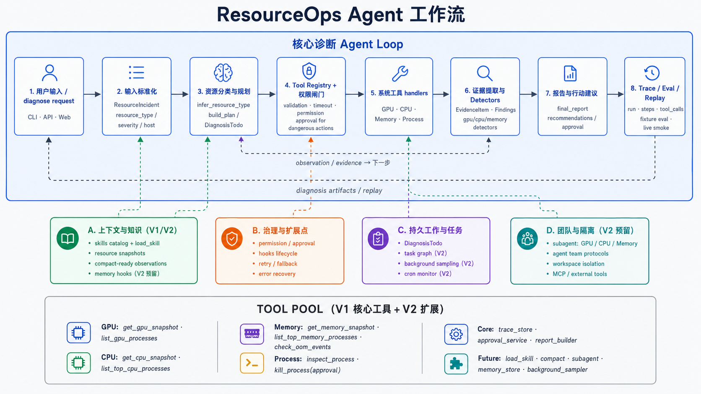

# ResourceOps Agent 方案设计

> 基于原 `IncidentOps Agent` 的工程底座，重新收敛为面向 **GPU / CPU / Memory** 三类真实资源问题的本地诊断 Agent。第一版只要求能稳定、正确、可测试地处理三类问题；第二版再逐步引入 learn-claude-code 中的 hooks、TodoWrite、subagent、compact、skills、memory、error recovery、task system、background tasks、agent team、autonomous agents、workspace isolation 等 Agent Harness 机制。

---




## 目录

- [0. 项目定位](#0-项目定位)
- [1. 回顾原 IncidentOps Agent](#1-回顾原-incidentops-agent)
- [2. 新项目目标](#2-新项目目标)
- [3. 产品形态](#3-产品形态)
- [4. 第一版功能范围](#4-第一版功能范围)
- [5. 第一版 Agent 工作流程](#5-第一版-agent-工作流程)
- [6. 核心模块设计](#6-核心模块设计)
- [7. ResourceAgent 设计](#7-resourceagent-设计)
- [8. Detector 设计](#8-detector-设计)
- [9. 报告设计](#9-报告设计)
- [10. Approval 设计](#10-approval-设计)
- [11. Trace 设计](#11-trace-设计)
- [12. Eval 设计](#12-eval-设计)
- [13. CLI 设计](#13-cli-设计)
- [14. API 设计](#14-api-设计)
- [15. 第一版目录结构](#15-第一版目录结构)
- [16. 为第二版预留的扩展点](#16-为第二版预留的扩展点)
- [17. 第一版开发阶段](#17-第一版开发阶段)
- [18. 第二版开发阶段](#18-第二版开发阶段)
- [19. 为什么这样设计](#19-为什么这样设计)
- [20. 简历表述](#20-简历表述)

---

# 0. 项目定位

原项目 `IncidentOps Agent` 面向企业线上故障诊断，核心是：

> 接收服务告警，查询 logs、metrics、deploys、runbooks、historical incidents，生成根因报告，并对高风险操作走人工审批。

这个方向工程化程度高，但对当前阶段有一个明显问题：

> 场景依赖大量模拟数据，短期内缺少真实生产日志、指标和发布记录，导致产品感不强。

因此，新项目方向调整为：

# ResourceOps Agent：面向 GPU / CPU / Memory 的本地资源诊断 Agent

一句话定义：

> ResourceOps Agent 是一个面向开发者和 AI 训练场景的本地资源诊断 Agent。它能够自动检查 GPU、CPU、内存状态，定位异常进程，结合诊断规则和 skills 生成诊断报告，并对危险操作进行人工审批。

第一版只处理三类问题：

```text
1. GPU 问题
2. CPU 问题
3. Memory 问题
```

第二版再逐步加入：

```text
hooks
TodoWrite
subagent
compact
skills
memory
error recovery
task system
background tasks
agent team
autonomous agents
workspace isolation
```

第一版不能为了简单而写死成无法扩展的脚本。它必须保留原 IncidentOps 的核心工程结构：

```text
ToolRegistry
TraceStore
Approval
Eval
FastAPI
CLI
AgentRun / AgentStep / ToolCall
```

---

# 1. 回顾原 IncidentOps Agent

## 1.1 原项目已经做对的地方

原 IncidentOps Agent 的核心优点是：

```text
1. 有统一输入对象 Incident
2. 有 AgentRun 记录一次诊断
3. 有 AgentStep 记录每一步 thought/action/observation
4. 有 ToolRegistry 管理工具
5. 有 ToolExecutionResult 统一工具返回
6. 有 permission_level 区分 safe / write / dangerous
7. 有 Approval 处理危险操作
8. 有 TraceStore 支持复盘
9. 有 Eval 支持回归测试
10. 有 FastAPI 支持 HTTP 调用
```

这些结构都应该保留。

因为它们不是 AIOps 专属，而是通用 Agent Harness 的底座。

---

## 1.2 原项目的问题

原项目的问题不是工程结构，而是产品范围。

原来的问题域是：

```text
payment-api
order-api
user-api
logs
metrics
deploys
runbooks
historical incidents
```

这些东西大多是模拟出来的。

所以它更像：

```text
高质量工程 demo
```

而不是：

```text
当前服务器上真的能用的诊断工具
```

这会带来几个问题：

```text
1. 真实感弱
2. 数据可信度弱
3. 很难验证 Agent 是否真的有效
4. 不容易扩展成日常可使用的工具
5. LLM 接入后也容易变成“对模拟世界的智能”
```

因此，项目应该收窄到能真实采集、真实制造、真实验证的问题域。

---

## 1.3 可复用的工程底座

原项目中以下模块可以保留或轻微改名后继续使用：

| 原模块 | 新项目中的用途 |
|---|---|
| `app/schemas.py` | 定义 ResourceIncident、DiagnosisRun、DiagnosisStep、Approval 等 schema |
| `tools/registry.py` | 继续作为所有系统诊断工具的统一注册和执行层 |
| `trace/store.py` | 继续保存 run、step、tool_call、approval、finding |
| `approval/` | 继续处理 dangerous action 的人工审批 |
| `eval/` | 从 incident case 改为 resource diagnosis case |
| `app/api.py` | 从 `/incident` 改为 `/diagnose` |
| `main.py` | 从 `incident` 命令改为 `diagnose` 命令 |

---

# 2. 新项目目标

## 2.1 第一版目标

第一版目标不是做一个全能运维 Agent，而是做一个能稳定处理三类本地资源问题的 Agent：

```text
GPU
CPU
Memory
```

第一版必须做到：

```text
1. 能采集当前机器真实资源状态
2. 能识别 GPU / CPU / Memory 相关异常
3. 能定位可疑进程
4. 能生成证据链报告
5. 能区分安全建议和危险操作
6. 危险操作必须走 approval
7. 每次诊断都有 trace
8. 能用真实 stress 脚本测试
9. 能通过 eval 回归测试
```

第一版暂时不追求：

```text
1. 多 agent 协作
2. 长期后台自治
3. 完整 LLM ReAct
4. 大规模 RAG
5. Kubernetes / Prometheus / Loki
6. 自动 kill 进程
7. 复杂 UI
```

---

## 2.2 第二版目标

第二版再引入 learn-claude-code 风格的 harness 能力：

```text
1. hooks：在工具调用前后、诊断开始结束、审批前后插入控制逻辑
2. TodoWrite：让 Agent 显式维护诊断任务列表
3. subagent：GPU / CPU / Memory 各自成为隔离诊断子 Agent
4. compact：压缩长 trace 和大量工具结果
5. skills：按需加载诊断知识
6. memory：记录机器历史基线、常见进程、用户偏好
7. error recovery：工具失败时自动 fallback
8. task system：支持长任务、依赖任务、采样任务
9. background tasks：后台持续监控资源变化
10. agent team：多个诊断 Agent 协作
11. autonomous agents：后台 Agent 自动发现异常并创建任务
12. workspace isolation：每次诊断拥有独立 run workspace
```

第二版的核心不是推翻第一版，而是在第一版的 harness 上叠加这些机制。

---

# 3. 产品形态

## 3.1 用户是谁

第一版目标用户是：

```text
1. 你自己
2. 使用 GPU 服务器的开发者
3. 做模型训练 / 推理实验的人
4. 需要排查本地资源瓶颈的工程师
```

它更偏：

```text
AI Infra / ML Infra / Developer Productivity
```

而不是传统 SRE 平台。

---

## 3.2 典型使用场景

### 场景 1：训练任务很慢

用户输入：

```text
我的训练任务为什么很慢？
```

Agent 需要检查：

```text
GPU 利用率
GPU 显存
CPU load
内存和 swap
进程列表
Python 进程命令行
```

可能结论：

```text
GPU 利用率很低，但 CPU load 很高，可能是 dataloader / 数据预处理瓶颈。
```

---

### 场景 2：GPU 显存满了

用户输入：

```text
为什么 GPU 显存满了？
```

Agent 需要检查：

```text
nvidia-smi
GPU memory used / total
GPU process list
PID
进程命令行
用户
启动时间
```

可能结论：

```text
GPU 0 显存占用 23.1GB / 24GB，主要由 PID 12345 的 python 进程占用。
```

建议：

```text
先确认该进程是否是当前训练任务。
如需终止进程，必须走 approval。
```

---

### 场景 3：CPU 很高

用户输入：

```text
服务器 CPU 为什么打满了？
```

Agent 需要检查：

```text
CPU load average
CPU core count
top CPU processes
进程命令行
是否有异常多进程
```

可能结论：

```text
load average 高于 CPU 核数，多个 python worker 占用 CPU，可能是数据加载或多进程任务过多。
```

---

### 场景 4：内存不够

用户输入：

```text
为什么内存快满了？
```

Agent 需要检查：

```text
total memory
available memory
swap usage
top memory processes
OOM events
进程 RSS / VMS
```

可能结论：

```text
系统内存使用率 92%，swap 使用率 70%，PID 12345 的 Python 进程占用 48GB RSS，疑似大对象缓存或内存泄漏。
```

---

# 4. 第一版功能范围

## 4.1 支持的问题类型

第一版定义三大类问题类型。

---

### GPU 类

```text
gpu_memory_pressure
gpu_low_utilization
gpu_process_hogging
gpu_unavailable
gpu_unknown
```

第一版重点处理：

```text
1. 显存占满
2. 多进程抢 GPU
3. GPU 利用率低但 CPU 很高
4. nvidia-smi 不可用
```

暂不处理：

```text
1. GPU 温度异常自动降频
2. CUDA driver mismatch
3. NCCL 分布式通信问题
4. 多机多卡网络瓶颈
```

这些可以第二版用 skills 扩展。

---

### CPU 类

```text
cpu_saturation
cpu_single_process_hot
cpu_load_high
cpu_bottleneck_for_gpu
cpu_unknown
```

第一版重点处理：

```text
1. CPU 使用率高
2. load average 高
3. 某个进程 CPU 占用高
4. GPU 利用率低但 CPU 高，判断为 CPU / dataloader 瓶颈
```

暂不处理：

```text
1. NUMA 绑定
2. kernel-level 调度问题
3. cgroup 限制
4. 容器 CPU quota
```

---

### Memory 类

```text
memory_pressure
swap_pressure
oom_event
memory_process_hogging
memory_leak_candidate
memory_unknown
```

第一版重点处理：

```text
1. 系统内存使用率高
2. swap 使用率高
3. 某进程 RSS 很高
4. dmesg 中存在 OOM killed 记录
5. 连续采样时某进程内存持续增长
```

暂不处理：

```text
1. Python 对象级别泄漏定位
2. PyTorch CUDA memory fragmentation 细节
3. JVM / Node.js 专用内存分析
4. eBPF 级内存追踪
```

---

# 5. 第一版 Agent 工作流程

## 5.1 总流程

```text
用户输入问题
  ↓
ResourceIncident 标准化
  ↓
ResourceAgent 创建 DiagnosisRun
  ↓
判断问题类型：gpu / cpu / memory / mixed / unknown
  ↓
生成诊断计划
  ↓
通过 ToolRegistry 执行工具
  ↓
记录 DiagnosisStep / ToolCall
  ↓
Detector 分析证据
  ↓
生成 DiagnosisFinding
  ↓
生成 final_report
  ↓
需要危险操作时创建 Approval
  ↓
保存 Trace
  ↓
用户 approve / reject
```

---

## 5.2 第一版不让 LLM 主导

第一版不应该让 LLM 自由决定所有工具调用。

第一版采用：

```text
规则分类
固定 plan
真实工具采集
规则 detector
可选 LLM report writer
```

也就是：

```text
deterministic core + optional LLM explanation
```

原因：

```text
1. 资源诊断需要稳定
2. 第一版要可测
3. 危险操作不能依赖 LLM 自觉
4. 先建立确定性基线，第二版再加入 LLM planner
```

---

## 5.3 第一版 Agent 模式

建议保留两种模式：

```text
deterministic
llm_report
```

### deterministic

```text
规则选择 plan
规则分析证据
模板生成报告
```

### llm_report

```text
规则选择 plan
规则分析证据
LLM 只负责把 evidence 写成自然语言报告
```

LLM report writer 必须遵守：

```text
1. 不能编造证据
2. 不能新增工具没有返回的事实
3. 不能新增危险操作
4. 不能把 pending approval 写成已执行
5. 必须保留 evidence 列表
```

---

# 6. 核心模块设计

## 6.1 app/schemas.py

保留原有思想，但改成资源诊断语义。

核心 schema：

```text
ResourceIncident
DiagnosisRun
DiagnosisStep
ToolCall
EvidenceItem
DiagnosisFinding
Recommendation
Approval
```

---

### ResourceIncident

字段：

```text
incident_id
description
resource_type
severity
source
created_at
host
```

resource_type：

```text
gpu
cpu
memory
mixed
unknown
```

---

### DiagnosisRun

字段：

```text
run_id
incident_id
status
user_input
agent_mode
final_report
root_cause
summary
started_at
ended_at
error
```

status：

```text
pending
running
waiting_approval
completed
failed
```

---

### DiagnosisStep

字段：

```text
step_id
run_id
step_index
thought
action
args
observation
observation_preview
latency_ms
status
error
created_at
```

注意：

```text
observation 存完整工具结果
observation_preview 存人类可读摘要
```

这能让 trace 更好读。

---

### EvidenceItem

字段：

```text
evidence_id
run_id
source_tool
category
level
message
data
confidence
created_at
```

category：

```text
gpu
cpu
memory
process
system
oom
skill
```

level：

```text
info
warning
critical
```

---

### DiagnosisFinding

字段：

```text
finding_type
title
description
evidence_ids
confidence
recommended_actions
requires_approval
```

---

### Recommendation

字段：

```text
action
description
risk
requires_approval
command_preview
reason
```

risk：

```text
safe
write
dangerous
```

---

## 6.2 tools/registry.py

ToolRegistry 继续保留。

工具执行仍然必须经过：

```text
1. 根据 name 找 ToolSpec
2. input_model 参数校验
3. permission_level 检查
4. timeout 控制
5. handler 执行
6. ToolExecutionResult 归一化
7. hook event 预留
```

ToolSpec 建议包含：

```text
name
description
input_model
handler
permission_level
timeout_seconds
retry
tags
```

tags 用于第二版 tool search / skill activation。

---

## 6.3 tools/gpu.py

第一版工具：

```text
get_gpu_snapshot
list_gpu_processes
```

---

### get_gpu_snapshot

功能：

```text
调用 nvidia-smi 查询 GPU 状态
```

返回：

```text
available
driver_version
cuda_version
gpus[]
```

每张 GPU：

```text
index
name
utilization_gpu_percent
memory_used_mb
memory_total_mb
memory_used_percent
temperature_c
power_draw_w
```

如果没有 GPU 或 nvidia-smi 不存在，返回：

```text
available=false
error=nvidia-smi not found
```

不能直接失败退出。

---

### list_gpu_processes

功能：

```text
列出占用 GPU 的进程
```

返回：

```text
pid
gpu_index
process_name
used_memory_mb
username
command
```

`command` 可以通过 `/proc/{pid}/cmdline` 补充。

---

## 6.4 tools/cpu.py

第一版工具：

```text
get_cpu_snapshot
list_top_cpu_processes
```

### get_cpu_snapshot

返回：

```text
cpu_count
load_avg_1m
load_avg_5m
load_avg_15m
overall_cpu_percent
per_cpu_percent
```

### list_top_cpu_processes

返回：

```text
pid
username
cpu_percent
memory_percent
rss_mb
command
started_at
```

---

## 6.5 tools/memory.py

第一版工具：

```text
get_memory_snapshot
list_top_memory_processes
check_oom_events
```

### get_memory_snapshot

返回：

```text
total_mb
available_mb
used_mb
used_percent
swap_total_mb
swap_used_mb
swap_used_percent
```

### list_top_memory_processes

返回：

```text
pid
username
rss_mb
vms_mb
memory_percent
command
```

### check_oom_events

第一版可以通过：

```text
dmesg
journalctl
/var/log/syslog
```

尝试读取 OOM 记录。

没有权限时返回：

```text
available=false
reason=permission denied
```

而不是让工具失败。

---

## 6.6 tools/process.py

第一版工具：

```text
inspect_process
```

输入：

```text
pid
```

返回：

```text
pid
ppid
username
status
cmdline
cwd
create_time
cpu_percent
memory_info
open_files_count
num_threads
children
```

危险工具先只做 schema，不默认开放：

```text
kill_process
```

`kill_process` 必须是：

```text
permission_level = dangerous
```

第一版可以只创建 approval，不真正 kill。

---

## 6.7 skills/

第一版可以先不用复杂 RAG，但目录要设计好。

```text
skills/
  gpu_memory_pressure.md
  gpu_low_utilization.md
  cpu_saturation.md
  memory_pressure.md
  oom_event.md
  dataloader_bottleneck.md
```

每个 skill 文件结构固定：

```markdown
# Skill: GPU Memory Pressure

## When to use
...

## Signals
...

## Checks
...

## Diagnosis
...

## Safe actions
...

## Dangerous actions
...

## Notes
...
```

第一版可以用关键词匹配加载 skill。

第二版再做 embedding / RAG。

---

# 7. ResourceAgent 设计

## 7.1 类结构

```text
agent/
  resource_agent.py
  planner.py
  detectors.py
  report.py
```

---

## 7.2 ResourceAgent.diagnose()

主流程：

```text
1. 创建 DiagnosisRun
2. infer_resource_type
3. build_plan
4. 执行 plan
5. collect evidence
6. run detectors
7. build report
8. create approvals
9. save trace
10. return ResourceAgentResult
```

---

## 7.3 infer_resource_type()

第一版规则：

```text
包含 gpu / cuda / 显存 / nvidia → gpu
包含 cpu / load / 卡顿 / 打满 → cpu
包含 memory / 内存 / swap / oom → memory
包含 slow / 训练慢 / bottleneck → mixed
否则 → mixed
```

建议默认 `mixed`，而不是 `unknown`。

因为很多真实问题，例如“训练很慢”，需要同时查 GPU、CPU、Memory。

---

## 7.4 build_plan()

### GPU plan

```text
1. get_gpu_snapshot
2. list_gpu_processes
3. get_cpu_snapshot
4. get_memory_snapshot
5. list_top_cpu_processes
6. list_top_memory_processes
7. load_skill(gpu_memory_pressure / gpu_low_utilization)
```

### CPU plan

```text
1. get_cpu_snapshot
2. list_top_cpu_processes
3. get_memory_snapshot
4. get_gpu_snapshot
5. load_skill(cpu_saturation)
```

### Memory plan

```text
1. get_memory_snapshot
2. list_top_memory_processes
3. check_oom_events
4. get_cpu_snapshot
5. get_gpu_snapshot
6. load_skill(memory_pressure / oom_event)
```

### Mixed plan

```text
1. get_gpu_snapshot
2. get_cpu_snapshot
3. get_memory_snapshot
4. list_gpu_processes
5. list_top_cpu_processes
6. list_top_memory_processes
7. check_oom_events
8. load_skill(dataloader_bottleneck / resource_bottleneck)
```

---

# 8. Detector 设计

## 8.1 Detector 输入

Detector 不直接调用工具。

Detector 只接收：

```text
tool_results
```

这样后面容易测试。

---

## 8.2 Detector 输出

每个 detector 输出：

```text
DiagnosisFinding | None
```

---

## 8.3 GPU detector

### detect_gpu_memory_pressure

条件示例：

```text
gpu.memory_used_percent >= 90
```

输出：

```text
finding_type = gpu_memory_pressure
confidence = high
evidence = GPU memory used >= 90%
recommendation = identify GPU processes
```

如果某个进程占用显存超过 70%：

```text
recommendation = check process owner and command
```

危险建议：

```text
kill_process
```

必须 `requires_approval=true`。

---

### detect_gpu_low_utilization_cpu_bottleneck

条件示例：

```text
gpu.utilization < 20%
and cpu.load_avg_1m > cpu_count
```

输出：

```text
finding_type = cpu_bottleneck_for_gpu
description = GPU utilization is low while CPU load is high
```

可能原因：

```text
dataloader bottleneck
CPU preprocessing too slow
too many workers
disk IO not yet monitored
```

---

## 8.4 CPU detector

### detect_cpu_saturation

条件示例：

```text
load_avg_1m > cpu_count * 1.2
or overall_cpu_percent > 85
```

输出：

```text
finding_type = cpu_saturation
```

---

### detect_single_process_cpu_hot

条件示例：

```text
top_process.cpu_percent > 150
```

在多核机器上，Python 多进程或多线程可能超过 100%。

输出：

```text
finding_type = cpu_single_process_hot
```

---

## 8.5 Memory detector

### detect_memory_pressure

条件示例：

```text
memory.used_percent > 85
or available_mb < 1024
```

输出：

```text
finding_type = memory_pressure
```

---

### detect_swap_pressure

条件示例：

```text
swap_total_mb > 0
and swap_used_percent > 30
```

输出：

```text
finding_type = swap_pressure
```

---

### detect_oom_event

条件示例：

```text
check_oom_events 返回 OOM killed
```

输出：

```text
finding_type = oom_event
```

---

### detect_memory_hogging_process

条件示例：

```text
top_memory_process.rss_mb > total_memory * 0.4
```

输出：

```text
finding_type = memory_process_hogging
```

---

# 9. 报告设计

最终报告必须包含：

```text
1. 问题概览
2. 资源快照
3. 关键证据
4. 可能根因
5. 建议操作
6. 风险与审批
7. 后续排查建议
```

示例：

```markdown
## Resource Diagnosis Report

### 1. 问题概览
用户问题：为什么训练任务很慢？
诊断类型：mixed_resource_pressure

### 2. 资源快照
- GPU 0: utilization 8%, memory 23.1GB / 24GB
- CPU: load_avg_1m 32.4, cpu_count 16
- Memory: used 91%, swap used 64%

### 3. 关键证据
- GPU 利用率较低，但显存接近满载。
- CPU load 高于核心数，说明 CPU 侧存在排队。
- Top CPU processes 中多个 python dataloader worker 占用 CPU。
- 系统 swap 使用率较高，可能进一步拖慢数据加载。

### 4. 可能根因
当前训练慢的主要原因可能不是 GPU 算力不足，而是 CPU / 内存压力导致的数据加载瓶颈。

### 5. 建议操作
- 降低 dataloader num_workers。
- 检查数据预处理是否过重。
- 释放无关 GPU 进程。
- 观察 swap 是否持续增长。

### 6. 风险与审批
未自动执行危险操作。
如需终止进程，需要人工审批。

### 7. 后续排查
建议增加 60 秒资源采样，以确认 CPU、内存和 GPU 利用率趋势。
```

---

# 10. Approval 设计

第一版保留 approval，但默认不真正执行危险操作。

危险动作：

```text
kill_process
terminate_training_job
clear_gpu_process
```

第一版只支持：

```text
create approval
approve 后输出模拟执行
reject 后记录拒绝
```

第二版再考虑真实 kill。

审批对象：

```text
approval_id
run_id
action
args
reason
risk
status
created_at
decided_at
executed_at
```

---

# 11. Trace 设计

第一版 Trace 必须比原项目更清楚。

每个 run 保存：

```text
run
steps
tool_calls
evidence_items
findings
approvals
```

`show_trace.py` 输出：

```text
run_id=...
status=completed
user_input=...
resource_type=mixed

steps:
#0 get_gpu_snapshot
  thought: 检查 GPU 是否存在显存或利用率异常
  observation_preview: GPU0 util=8%, mem=23100/24576MB

#1 get_cpu_snapshot
  thought: 检查 CPU 是否成为瓶颈
  observation_preview: load_avg_1m=32.4, cpu_count=16

findings:
- cpu_bottleneck_for_gpu confidence=high
- memory_pressure confidence=medium

approvals:
- none
```

---

# 12. Eval 设计

ResourceOps 的 eval 分两类：

```text
1. fixture eval
2. live smoke eval
```

---

## 12.1 fixture eval

用录制好的工具输出作为 fixture，不依赖当前机器状态。

目录：

```text
eval/fixtures/
  gpu_memory_pressure.json
  cpu_saturation.json
  memory_pressure.json
  mixed_training_slow.json
```

case 文件：

```text
eval/resource_cases.jsonl
```

每条 case：

```json
{
  "case_id": "gpu_memory_pressure_single_process",
  "description": "为什么 GPU 显存满了？",
  "fixture": "gpu_memory_pressure.json",
  "expected_findings": ["gpu_memory_pressure"],
  "expected_evidence_keywords": ["memory", "GPU", "process"],
  "forbidden_actions": ["kill_process"],
  "requires_approval": false
}
```

为什么需要 fixture eval？

因为真实机器状态每天都不同，不能用实时资源作为单元测试基础。

---

## 12.2 live smoke eval

真实执行工具，验证 Agent 能不能跑通。

命令：

```bash
python eval/run_live_smoke.py
```

检查：

```text
get_gpu_snapshot 不崩
get_cpu_snapshot 不崩
get_memory_snapshot 不崩
ResourceAgent 能输出报告
Trace 能保存
```

Live smoke 不要求固定根因，只要求系统可用。

---

## 12.3 stress eval

可选，通过脚本制造压力。

```text
scripts/stress_cpu.py
scripts/stress_memory.py
scripts/stress_gpu_memory.py
```

注意：

```text
stress_memory.py 必须限制最大内存，避免把服务器打挂
stress_gpu_memory.py 必须要求用户确认
stress_cpu.py 必须能 Ctrl+C 干净退出
```

---

# 13. CLI 设计

第一版命令：

```bash
python main.py diagnose "为什么 GPU 显存满了？"
```

指定类型：

```bash
python main.py diagnose "系统 CPU 很高" --resource-type cpu
python main.py diagnose "内存快满了" --resource-type memory
python main.py diagnose "训练任务很慢" --resource-type mixed
```

查看 trace：

```bash
python main.py trace <run_id>
```

查看 approvals：

```bash
python main.py approvals
```

批准：

```bash
python main.py approve <approval_id>
```

拒绝：

```bash
python main.py reject <approval_id>
```

采样：

```bash
python main.py sample --duration 60 --interval 5
```

采样可以第二版做，第一版先保留命令设计。

---

# 14. API 设计

第一版保留 FastAPI。

接口：

```text
GET  /health
POST /diagnose
GET  /runs
GET  /runs/{run_id}
GET  /approvals
POST /approvals/{approval_id}/approve
POST /approvals/{approval_id}/reject
```

POST `/diagnose` 请求：

```json
{
  "description": "为什么 GPU 显存满了？",
  "resource_type": "gpu",
  "severity": "warning",
  "agent_mode": "deterministic"
}
```

返回：

```json
{
  "run": {},
  "steps": [],
  "findings": [],
  "final_report": "...",
  "requires_approval": false,
  "approvals": []
}
```

---

# 15. 第一版目录结构

```text
resourceops-agent/
├── README.md
├── DESIGN.md
├── requirements.txt
├── .env.example
├── main.py
├── app/
│   ├── api.py
│   ├── cli.py
│   └── schemas.py
├── agent/
│   ├── resource_agent.py
│   ├── planner.py
│   ├── detectors.py
│   └── report.py
├── tools/
│   ├── registry.py
│   ├── gpu.py
│   ├── cpu.py
│   ├── memory.py
│   ├── process.py
│   └── system.py
├── skills/
│   ├── gpu_memory_pressure.md
│   ├── gpu_low_utilization.md
│   ├── cpu_saturation.md
│   ├── memory_pressure.md
│   ├── oom_event.md
│   └── dataloader_bottleneck.md
├── approval/
│   ├── store.py
│   └── service.py
├── trace/
│   ├── store.py
│   ├── models.py
│   └── replay.py
├── eval/
│   ├── resource_cases.jsonl
│   ├── fixtures/
│   ├── run_eval.py
│   └── run_live_smoke.py
├── scripts/
│   ├── stress_cpu.py
│   ├── stress_memory.py
│   └── stress_gpu_memory.py
├── tests/
│   ├── test_tools_cpu.py
│   ├── test_tools_memory.py
│   ├── test_tools_gpu.py
│   ├── test_detectors.py
│   ├── test_agent.py
│   └── test_api.py
└── var/
    ├── resourceops.sqlite3
    └── runs/
```

---

# 16. 为第二版预留的扩展点

第一版虽然不实现 learn-claude-code 的高级机制，但必须提前预留接口。

---

## 16.1 hooks 预留

第一版 ToolRegistry 内部预留 HookManager。

事件类型：

```text
DiagnosisStart
BeforePlan
AfterPlan
PreToolUse
PostToolUse
ToolError
EvidenceAdded
BeforeReport
ApprovalRequested
RunCompleted
RunFailed
```

第一版可以先只做 no-op。

第二版接入：

```text
PreToolUse：阻止危险命令
PostToolUse：记录审计
ToolError：触发 error recovery
BeforeReport：注入 memory / skills
RunCompleted：写入长期 memory
```

---

## 16.2 TodoWrite 预留

第一版的 plan 不要只是 list。

应该定义：

```text
DiagnosisTodo
```

字段：

```text
todo_id
run_id
title
status
tool_name
args
depends_on
created_at
updated_at
```

第一版可以从 plan 自动生成 todos。

第二版让 LLM 或 Agent 自己维护 TodoWrite。

---

## 16.3 subagent 预留

第一版 ResourceAgent 统一调度。

第二版拆成：

```text
GpuDiagnosticAgent
CpuDiagnosticAgent
MemoryDiagnosticAgent
ProcessInspectionAgent
ReportAgent
```

每个 subagent 有独立 context，只返回结构化结果。

第一版要避免把所有逻辑写在一个巨大 `diagnose()` 里。

---

## 16.4 compact 预留

第一版工具结果可能已经很大。

因此每个 `ToolExecutionResult` 必须有：

```text
data
preview
summary
```

Trace 里展示 preview。

第二版做 compact：

```text
raw observation → compacted observation → evidence summary
```

---

## 16.5 skills 预留

第一版 skill 可以用 markdown + 关键词匹配。

第二版升级为：

```text
skill manifest
skill search
skill activation
skill result injection
```

skill manifest：

```yaml
name: gpu_memory_pressure
triggers:
  - gpu
  - memory
  - cuda oom
  - nvidia-smi
tools:
  - get_gpu_snapshot
  - list_gpu_processes
```

---

## 16.6 memory 预留

第一版先不做 memory，但 schema 预留：

```text
memory/
  store.py
```

第二版存：

```text
1. machine baseline
2. historical diagnoses
3. known safe processes
4. user preferences
5. ignored processes
6. recurring problems
```

例如：

```text
用户偏好：不要建议 kill jupyter
机器基线：GPU 空闲时显存通常 500MB
历史问题：昨天同一个 PID 模式造成过内存压力
```

---

## 16.7 error recovery 预留

第一版工具失败要返回结构化错误，而不是抛崩。

错误类型：

```text
command_not_found
permission_denied
timeout
parse_error
unsupported_platform
no_gpu
```

第二版 ErrorRecoveryPolicy：

```text
nvidia-smi 不存在 → 返回 no_gpu，不再继续 GPU 深查
dmesg 权限不足 → 尝试 journalctl
psutil 失败 → fallback 到 ps
工具超时 → 降级为 lighter command
```

---

## 16.8 task_system 预留

第一版一次诊断是同步执行。

第二版支持长任务：

```text
sample_resource_for_60s
watch_process_memory_growth
monitor_gpu_utilization
```

Task schema：

```text
task_id
run_id
title
status
depends_on
assigned_agent
workspace
created_at
updated_at
result
```

---

## 16.9 background_tasks 预留

第二版新增：

```text
background sampler
periodic monitor
long-running diagnosis
```

例如：

```text
每 5 秒采样一次 GPU / CPU / Memory，持续 60 秒。
```

这对 memory leak 和 GPU low utilization 很关键。

---

## 16.10 agent_team 预留

第二版可以设计：

```text
LeadResourceAgent
GpuAgent
CpuAgent
MemoryAgent
ProcessAgent
ReportAgent
```

协作方式：

```text
LeadResourceAgent 创建任务
各 subagent 领取任务
结果写入 trace / task board
Lead 汇总报告
```

---

## 16.11 autonomous_agents 预留

第二版做 always-on 模式：

```text
ResourceMonitorAgent 每隔 30 秒检查资源
发现异常自动创建 diagnosis task
后台 Agent 自动 claim task
生成告警或日报
```

第一版不做，但数据结构不要阻碍这个方向。

---

## 16.12 workspace isolation 预留

原 learn-claude-code 的 worktree isolation 是为了代码任务隔离。

ResourceOps 不一定需要 git worktree，但需要 run workspace isolation。

每次 run 创建：

```text
var/runs/run_xxx/
  raw/
  compact/
  report.md
  tool_calls.jsonl
  evidence.jsonl
```

好处：

```text
1. 每次诊断结果隔离
2. 方便 replay
3. 方便上传 debug bundle
4. 方便 background task 写入采样数据
```

---

# 17. 第一版开发阶段

## V1-P0：项目重命名和 schema 调整

目标：

```text
从 IncidentOps 迁移到 ResourceOps。
```

任务：

```text
1. 保留 ToolRegistry / TraceStore / Approval
2. 新增 ResourceIncident
3. 新增 EvidenceItem / DiagnosisFinding
4. CLI 从 incident 改成 diagnose
5. README 更新目标
```

完成标准：

```bash
python main.py diagnose "为什么 CPU 很高？"
```

能创建 run，但可以暂时不诊断。

---

## V1-P1：实现真实资源工具

目标：

```text
能真实采集 GPU / CPU / Memory / Process 信息。
```

任务：

```text
1. get_cpu_snapshot
2. list_top_cpu_processes
3. get_memory_snapshot
4. list_top_memory_processes
5. check_oom_events
6. get_gpu_snapshot
7. list_gpu_processes
8. inspect_process
```

完成标准：

```bash
python -m pytest tests/test_tools_*.py
```

通过。

---

## V1-P2：实现 deterministic ResourceAgent

目标：

```text
根据问题类型执行固定 plan。
```

任务：

```text
1. infer_resource_type
2. build_gpu_plan
3. build_cpu_plan
4. build_memory_plan
5. build_mixed_plan
6. 执行 ToolRegistry
7. 保存 steps / tool_calls
```

完成标准：

```bash
python main.py diagnose "为什么 GPU 显存满了？"
```

能执行完整工具链。

---

## V1-P3：实现 detectors

目标：

```text
把工具结果变成诊断结论。
```

任务：

```text
1. detect_gpu_memory_pressure
2. detect_gpu_low_utilization_cpu_bottleneck
3. detect_cpu_saturation
4. detect_memory_pressure
5. detect_swap_pressure
6. detect_oom_event
7. detect_memory_hogging_process
```

完成标准：

```text
fixture eval 能识别 expected_findings。
```

---

## V1-P4：报告和审批

目标：

```text
生成可读诊断报告，并处理危险操作审批。
```

任务：

```text
1. build_final_report
2. create approval for kill_process
3. approve / reject
4. trace 状态更新
```

完成标准：

```text
危险操作不会直接执行。
```

---

## V1-P5：Eval 和真实测试脚本

目标：

```text
证明 Agent 对三类问题有效。
```

任务：

```text
1. fixture eval
2. live smoke eval
3. stress_cpu.py
4. stress_memory.py
5. stress_gpu_memory.py
```

完成标准：

```bash
python eval/run_eval.py
python eval/run_live_smoke.py
```

通过。

---

## V1-P6：FastAPI 和 README

目标：

```text
可通过 HTTP 调用，可展示。
```

任务：

```text
1. POST /diagnose
2. GET /runs
3. GET /runs/{run_id}
4. GET /approvals
5. approve / reject
6. README demo
```

完成标准：

```bash
uvicorn app.api:app --host 0.0.0.0 --port 18000
```

然后 curl 能跑完整流程。

---

# 18. 第二版开发阶段

## V2-P1：Hooks

实现 HookManager。

先支持：

```text
PreToolUse
PostToolUse
ToolError
BeforeReport
RunCompleted
```

用途：

```text
1. 安全拦截
2. 审计日志
3. 自动 compact
4. 自动写 memory
5. 工具失败恢复
```

---

## V2-P2：TodoWrite

把 plan 改成显式 todo board。

```text
Agent 先写诊断任务列表
再逐项执行
trace 展示 task 状态
```

---

## V2-P3：Skills

实现 skill manifest 和 skill loader。

第一版 markdown skills 升级为：

```text
list_skills
load_skill
search_skill
```

---

## V2-P4：Memory + Compact

新增：

```text
MemoryStore
Compactor
```

记住：

```text
机器基线
历史异常
常见进程
用户偏好
```

---

## V2-P5：Background Tasks

支持：

```text
60 秒采样
内存增长趋势
GPU 利用率趋势
```

---

## V2-P6：Subagents

拆成：

```text
GPUAgent
CPUAgent
MemoryAgent
ProcessAgent
ReportAgent
```

Lead Agent 只做协调。

---

## V2-P7：Agent Team / Autonomous Agents

引入 task board：

```text
待诊断任务
后台 monitor 发现异常
Agent 自动 claim
Agent 自动生成报告
```

---

## V2-P8：Workspace Isolation

每个 run 一个 workspace：

```text
var/runs/run_xxx/
```

支持 replay、debug bundle、长期采样。

---

# 19. 为什么这样设计

这个设计的核心是：

```text
第一版聚焦真实可测。
第二版扩展 agent harness。
```

第一版不追求炫技，而是要证明：

```text
1. Agent 能查真实机器状态
2. Agent 能基于证据诊断
3. Agent 能克制，不乱执行危险操作
4. Agent 有 trace 和 eval
```

第二版再逐步变成：

```text
有 hooks
有 skills
有 memory
有 subagents
有 task system
有 background autonomous agents
```

这条路线比继续扩展模拟 IncidentOps 更稳，也更有产品感。

---

# 20. 简历表述

## 项目一句话

> 设计并实现 ResourceOps Agent，一个面向 GPU / CPU / Memory 资源异常的本地诊断 Agent。系统通过 Tool Registry 采集 nvidia-smi、psutil、进程、OOM 等真实运行时信息，基于 evidence detectors 生成资源瓶颈诊断报告，并对 kill process 等危险操作引入 Human-in-the-loop 审批。项目支持 CLI / FastAPI 调用、Trace / Replay、Eval 回归测试，并预留 hooks、skills、memory、subagent、background task 等 Agent Harness 扩展机制。

## 简历 bullet

```text
- 构建 GPU/CPU/Memory 资源诊断 Agent，支持真实系统指标采集、异常进程定位和证据链报告生成。
- 设计 ToolRegistry、permission level、Approval、TraceStore 等 Agent Harness 基础设施，实现安全可审计的工具调用流程。
- 实现 deterministic detectors 识别 GPU 显存压力、CPU saturation、Memory pressure、Swap pressure、OOM event 等问题。
- 设计 fixture eval 与 live smoke eval，区分可复现测试和真实环境测试，保证 Agent 在动态机器状态下仍可验证。
- 预留 hooks、skills、memory、subagent、background task、workspace isolation 等扩展点，为第二阶段 LLM-driven Agent Harness 演进做准备。
```

---

# 21. 最终建议

不要直接在原 IncidentOps 上继续堆服务故障规则。

建议正式开一个清晰分支或新目录，把项目收敛成：

```text
ResourceOps Agent
```

第一版把 GPU / CPU / Memory 做到真实可测。

第二版再按 learn-claude-code 的 harness 机制逐个加入：

```text
hooks
TodoWrite
skills
memory
subagents
background tasks
agent team
autonomous agents
workspace isolation
```

最终目标不是做一个普通脚本，而是做一个：

```text
真实可用 + 可追踪 + 可评测 + 可扩展的本地资源诊断 Agent Harness
```
